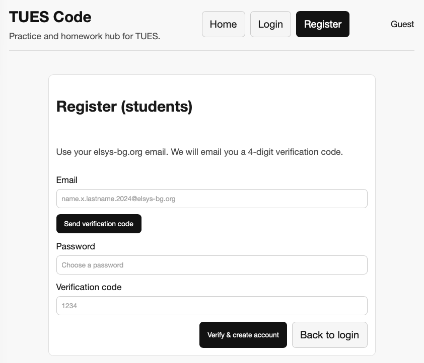
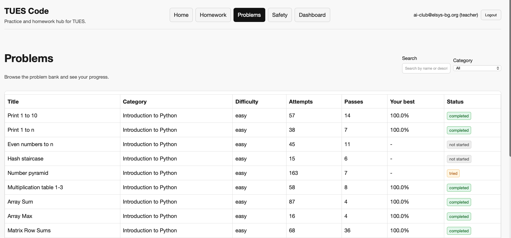
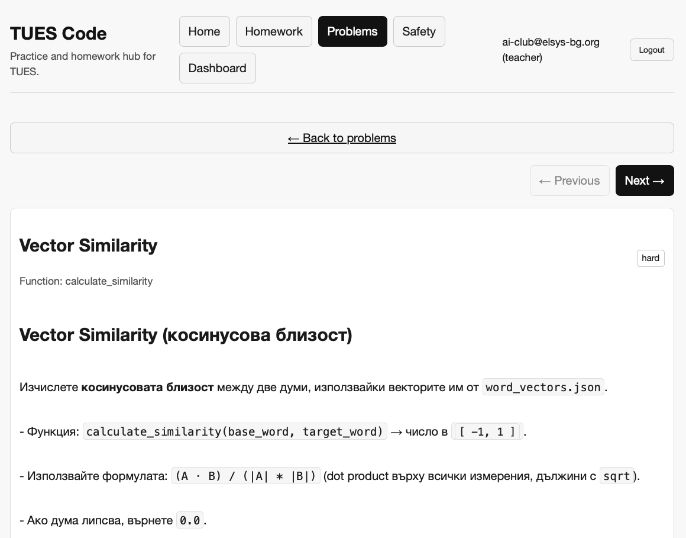
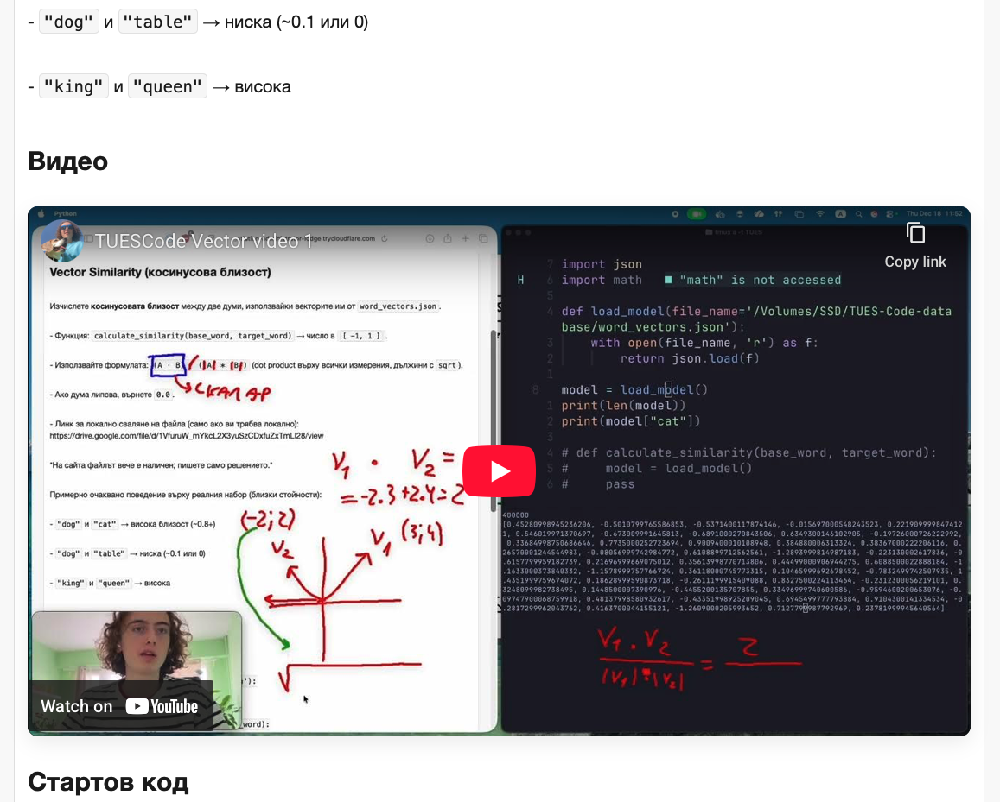
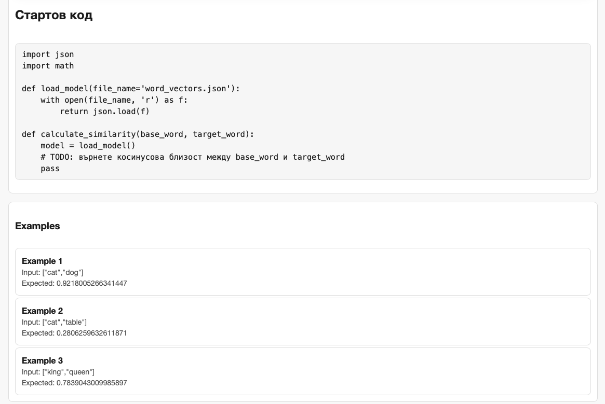
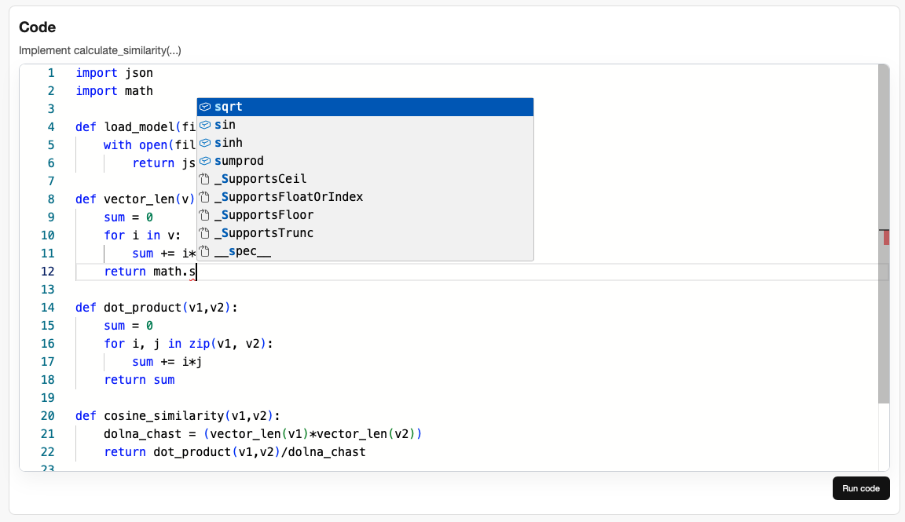
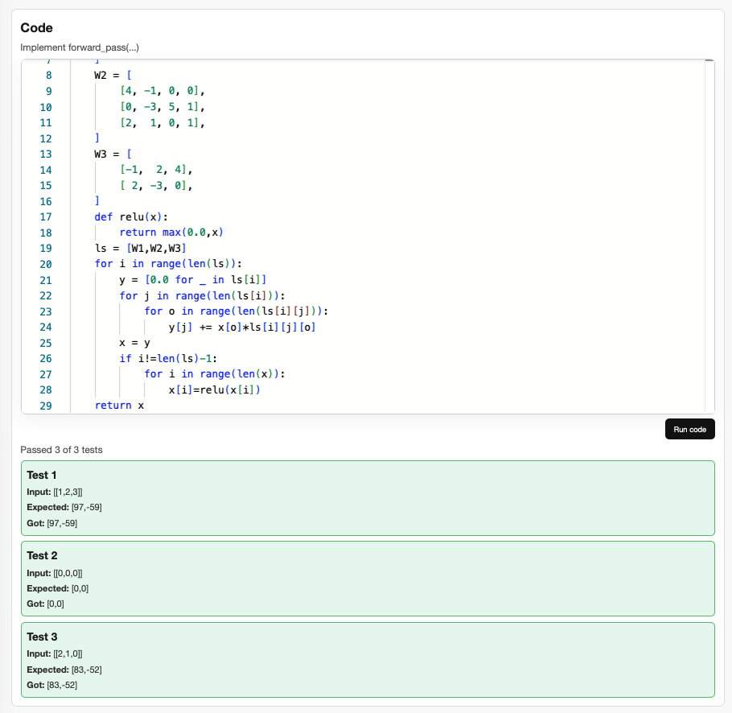
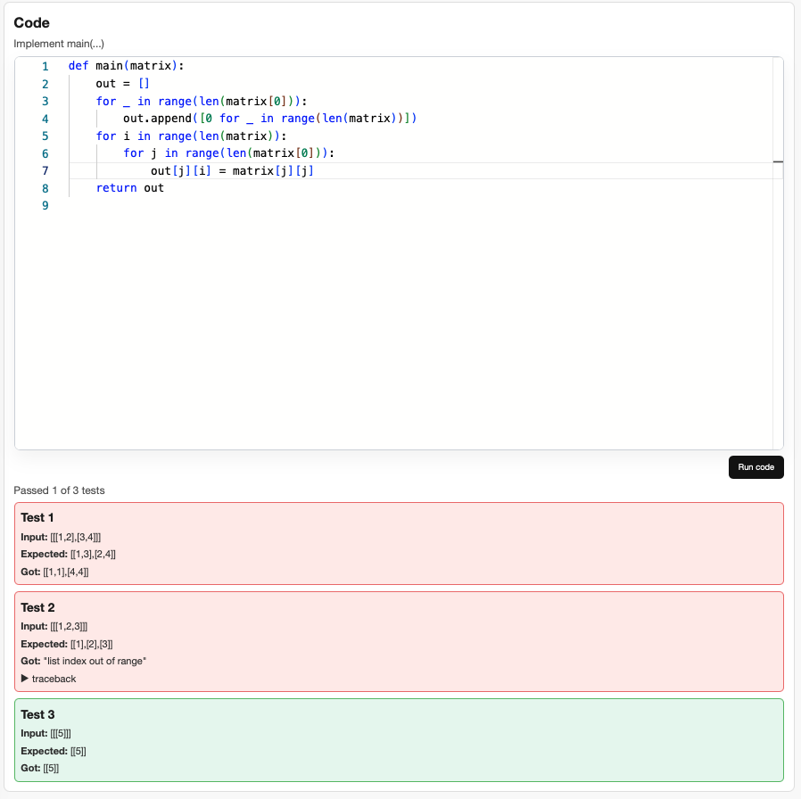
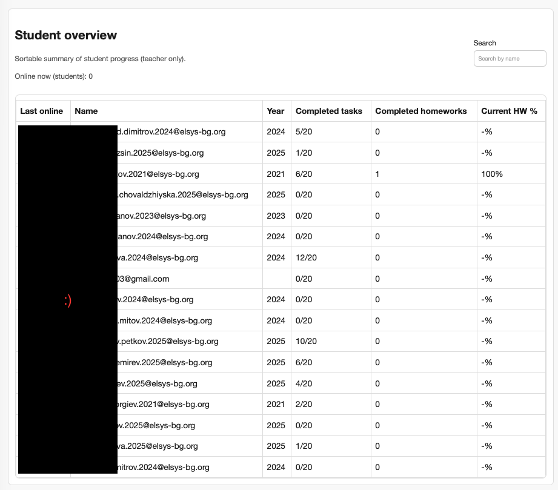
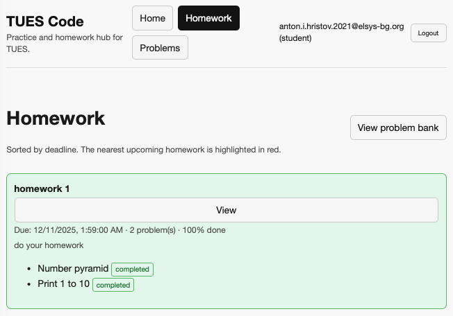

# [TuesCode](https://tues-ai.github.io/TuesCode)
### Custom Leetcode/Khan academy style coding and math site by students for students in the TUES AI club.

---

This repo is just used as free domain for the backend of the site. Click the title to go to the actual site if its ON right now.

I may make the backend public in future versions when I am sure all vulnerabilities and answer leaks are prevented.

